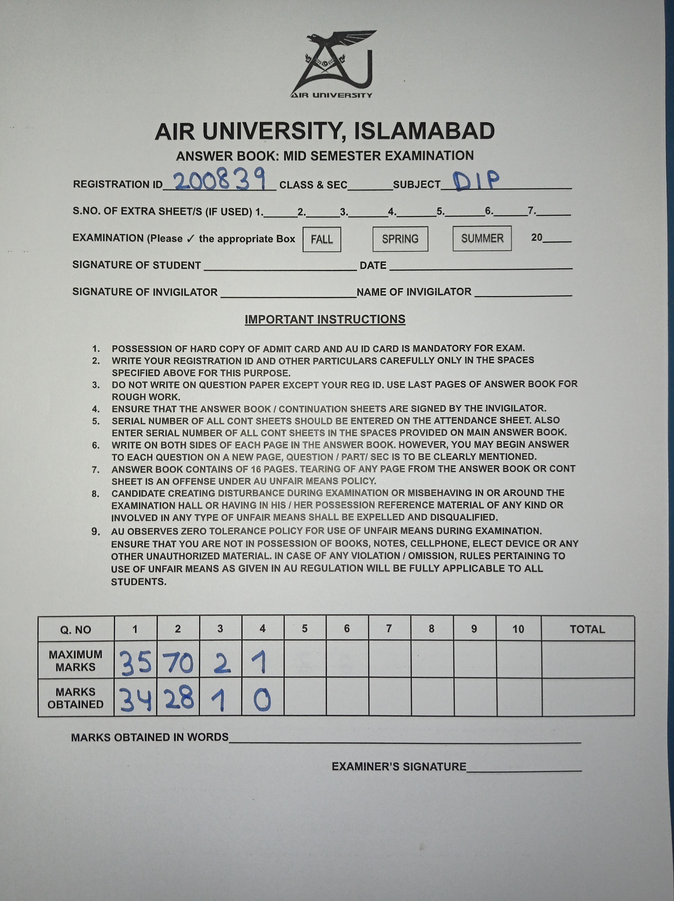
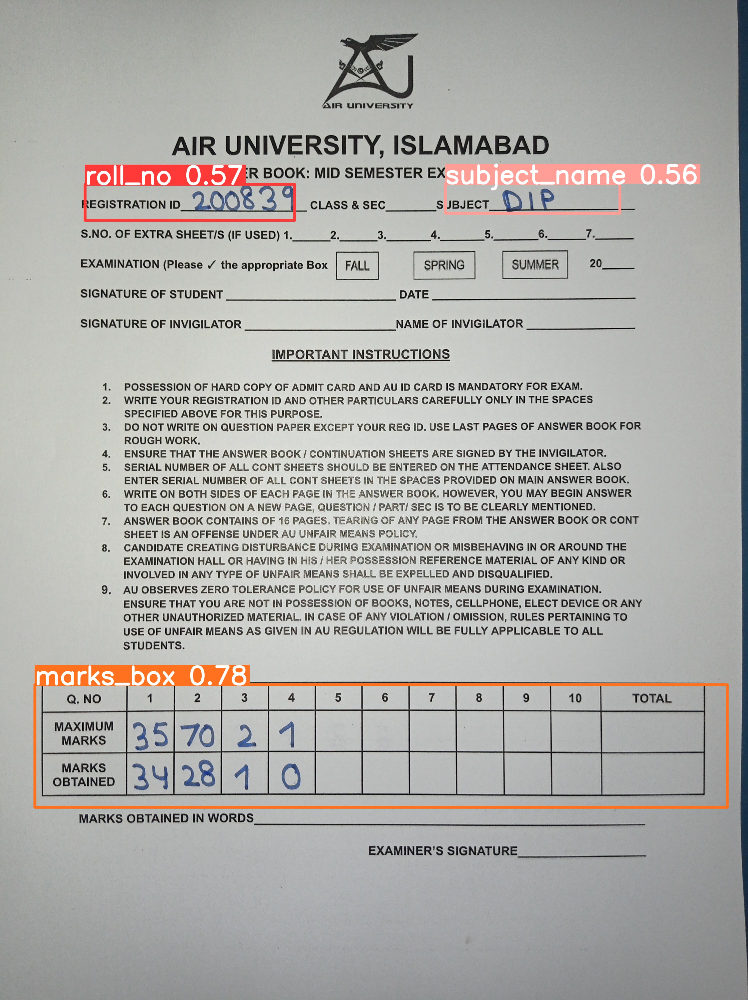
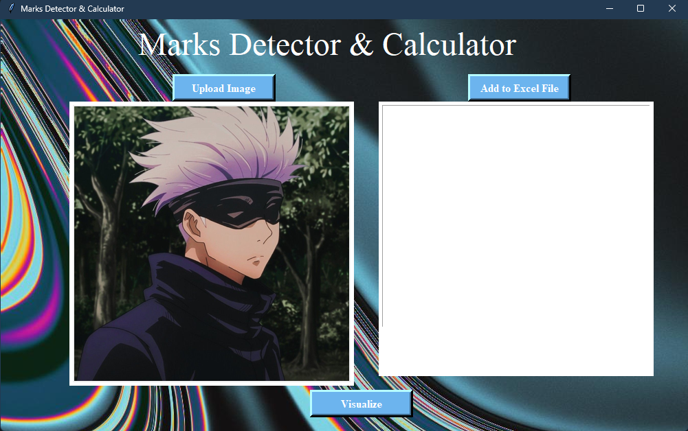
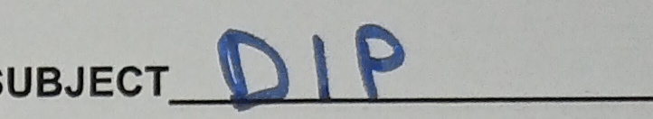

# Marks Detector & Calculator

## To Run Project:
- clone
- open main.py
- edit the path variable to your system
- run main.py

## Things Learnt
- Custom YOLO Model
- Incorporating Model with user data
- Using OCR
- Image Labeling
- Tkinter
#
# How the Model Works
Suppose we have a Answer Sheet like the following:

Our Model will Scan this, and detect the Portion we need from this:

#
## Final Result
Below is the UI made using tkinter

Now, the user will upload the image & after going through whole process (explained below) it will detect & caluclate the information from the image. 

When Add to Excel File button is clicked, it adds the data to Excel File.

#
# The Flow
When the model detects the classes, it saves the cropped images. Below is an example:

Before Applying OCR we need to Apply Image processing and detect edges from the above box.

On Applying morphological operation we detect the boxes & following is result:

Here:
- result1 - result10 are Questions Numbers

- result11 - result20 are Total Question Marks

- result21 - result30 are Marks Obtained

Applied OCR on the result11 - result20 images to calulate TOTAL MARKS.

Applied OCR on the result21 - result30 images to calculate Obtained Marks.

#
# Problems while building this

- OCR was not powerful enough to detect handwritten digits. (inaccuracy may occur)
- Training Model on small dataset.

